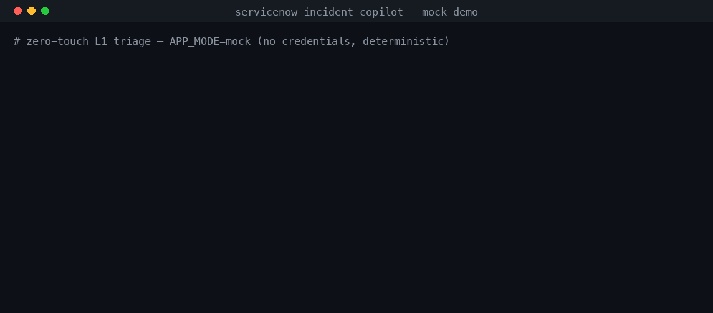

# ServiceNow Incident Copilot

[](https://github.com/akashreddi/servicenow-incident-copilot/actions/workflows/ci.yml)
[](https://www.python.org/downloads/)
[](https://github.com/astral-sh/ruff)

Zero-touch L1 incident triage: new incidents are automatically classified by Azure OpenAI, grounded in **company knowledge embeddings**, and routed to the right enterprise team in ServiceNow — no manual effort. Exposed as both a **FastAPI service** and an **MCP server** (connect it to Claude Desktop and triage incidents conversationally).

## Live demo

**▶ Live app: <https://servicenow-incident-copilot.onrender.com/docs>** — interactive API docs (free tier; first load may take ~50s if asleep, then it's instant)



_The recording above is the real `APP_MODE=mock` pipeline — deterministic, credential-free, and exactly what CI runs._

[](https://render.com/deploy?repo=https://github.com/akashreddi/servicenow-incident-copilot)

Deployed in **mock mode** — the entire pipeline runs offline with a deterministic LLM and an in-memory ServiceNow, so **no credentials are needed** and nothing sensitive is exposed. Try it:

- [**`/docs`**](https://servicenow-incident-copilot.onrender.com/docs) — interactive Swagger UI; click **"Try it out"** on `POST /demo/run-all` to auto-triage six incidents
- [**`/stats`**](https://servicenow-incident-copilot.onrender.com/stats) — live routing-accuracy dashboard (JSON)

> Hosted on Render's free tier, which sleeps after inactivity — the first request may take ~50s to wake, then it's instant. The GIF above is the same output with no wait.

## Why I built this

I'm drawn to the intersection of **ServiceNow and applied AI**, and I wanted to see what "AI integration" should really look like inside an ITSM platform — not a chatbot bolted onto the side, but AI wired into the operational flow where it removes genuine toil. L1 triage is the ideal target: high-volume, repetitive, and every misroute burns an SLA. So instead of a demo snippet, I built the entire zero-touch loop the way I'd want to run it in production — webhook in, RAG-grounded decision, write-back with an audit note — and pushed on the parts that are easy to hand-wave and hard to get right:

- **It runs with zero credentials.** The offline `APP_MODE=mock` stack implements the *exact same interfaces* as the live one (in-memory ServiceNow + a rule-based LLM double), so the pipeline can't tell the difference — and neither can `pytest`. I wanted anyone to be able to clone it and see it work in 60 seconds, and I wanted CI to exercise the real orchestration, not a stub.
- **The AI is accountable, not magic.** The model can only route to teams in the catalog; a hallucinated team name zeros the confidence; anything under the threshold parks in a human queue with the full reasoning written to the incident's work note. I care more about *trustworthy* automation than a flashy accuracy number.
- **It's provider- and infra-agnostic on purpose.** Swapping the LLM (Azure OpenAI ↔ OpenAI) or the vector store (in-memory ↔ ChromaDB ↔ Azure AI Search) is one env var, because everything depends on a protocol, not a concrete class. That's the difference between a proof-of-concept and something a team could actually adopt.

I built it in visible phases (see the commit history) — mock-first, then observability, then a second vector backend, then the MCP surface — because that's how I like to work: get a thin end-to-end slice running, then deepen it one honest layer at a time.

## How the zero-touch pipeline works

```
 ServiceNow                    Incident Copilot (FastAPI)                ServiceNow
┌───────────┐  Business Rule  ┌─────────────────────────────────┐  PATCH  ┌───────────┐
│ Incident   │───(webhook)───▶│ 1. Fetch incident (Table API)     │───────▶│ assignment │
│ created    │                │ 2. Embed & retrieve:              │        │ _group set │
└───────────┘                │    • company KB articles           │        │ + priority │
                              │    • similar past incidents        │        │ + category │
                              │      (with historical routing)     │        │ + AI work  │
                              │ 3. Azure OpenAI triage             │        │   note     │
                              │    (forced function calling →      │        └───────────┘
                              │     Pydantic-validated output)     │
                              │ 4. Confidence gate:                │
                              │    ≥ 0.7 → auto-route              │
                              │    < 0.7 → park in L1 queue        │
                              └─────────────────────────────────┘
```

Design decisions worth noting:

- **One `IncidentService` layer** serves both the REST API and the MCP tools — no duplicated logic.
- **The LLM tool schema is generated from the `TriageResult` Pydantic model**, so the AI contract and app contract can't drift.
- **Guardrails, not vibes**: the LLM can only route to teams in the catalog; hallucinated team names zero the confidence; low confidence falls back to a human queue with full reasoning in the work note.
- **Feedback loop**: `POST /learn/{sys_id}` indexes resolved incidents back into the vector store, so routing accuracy improves with history.

## Stack

FastAPI · Pydantic v2 · httpx (async) · OAuth 2.0 · ServiceNow Table API · Azure OpenAI (chat + embeddings, standard OpenAI fallback) · ChromaDB (swappable for Azure AI Search) · MCP (FastMCP) · Docker Compose · pytest + respx · GitHub Actions · structured JSON logging

## Quick start

### 60-second demo, zero credentials (mock mode)

```bash
pip install -r requirements.txt
APP_MODE=mock uvicorn app.main:app --port 8000
curl -X POST localhost:8000/demo/run-all | jq
```

Six realistic incidents get triaged and routed instantly by a deterministic
offline stack (in-memory ServiceNow + rule-based LLM double) that implements the
exact same interfaces as the live one — the pipeline can't tell the difference.

### Live mode (real PDI + Azure OpenAI)

```bash
cp .env.example .env          # fill in PDI + OpenAI credentials
pip install -r requirements.txt -r requirements-dev.txt
python -m scripts.seed_data --snow   # index KB + history, create demo incidents
uvicorn app.main:app --reload
```

Zero-touch setup: create the Business Rule + Outbound REST Message from
`integration/servicenow_business_rule.js` (use `ngrok http 8000` locally).
Now every new incident routes itself.

Manual demo without the webhook:

```bash
curl -X POST localhost:8000/triage/<sys_id> | jq
```

### Observability

Every request gets a correlation ID (honored from an inbound `X-Correlation-ID`
header — e.g. propagated from MuleSoft — or minted fresh) that tags every log
line in that incident's journey and is echoed back in the response header. Grep
one cid to trace a single incident end to end.

`GET /stats` returns a live routing dashboard:

```json
{
  "processed": 6, "auto_routed": 6, "auto_route_rate": 1.0,
  "low_confidence_fallbacks": 0, "avg_confidence": 0.84,
  "by_group": { "Network Operations": 1, "Security Operations": 1, ... },
  "by_priority": { "P1": 1, "P2": 3, "P3": 2 },
  "avg_stage_ms": { "retrieval": 0.6, "triage": 1.0, "writeback": 0.1 }
}
```

The `auto_route_rate` and per-group distribution are the metrics you'd watch to
tune the confidence threshold. Counters map 1:1 onto Prometheus if real scraping
is needed.

### Swappable vector backend

Three implementations satisfy one `VectorStore` protocol (`app/services/vector_store.py`):

| Backend | `VECTOR_BACKEND` | Used for |
|---|---|---|
| In-memory (cosine) | *(mock mode)* | zero-credential demo & tests |
| ChromaDB | `chroma` (default) | local live dev |
| Azure AI Search | `azure_ai_search` | production (HNSW vector search) |

Switching is one env var — `IncidentService` never changes, because it depends on
the protocol, not a concrete store. The Azure backend creates its indexes
idempotently on startup and pushes our own `text-embedding-3-small` vectors, so
retrieval quality is identical across backends. A test asserts all three expose
the same method signatures.

### MCP server (Claude Desktop)

Copy `integration/claude_desktop_config.example.json` into your Claude Desktop
config (set the absolute `cwd`). With `"APP_MODE": "mock"` it works with **zero
credentials** — flip to `live` once the PDI is wired.

Then ask Claude: *"Triage the incident about the CEO gift card email and explain
your routing"* or *"What are the routing stats for this session?"*

A full 3-minute recording script lives in `integration/DEMO_SCRIPT.md`.

### Docker

```bash
docker compose up --build
```

### Tests

```bash
pytest -v    # ServiceNow mocked with respx, LLM mocked — no credentials needed
```

## Enterprise topology (MuleSoft)

See [`integration/MULESOFT_DESIGN.md`](integration/MULESOFT_DESIGN.md) — API-led
connectivity design with a `servicenow-sapi` System API owning credentials and
policies. The client here is a one-file swap away from pointing at CloudHub.

## Roadmap

- ~~Azure AI Search backend~~ ✅ done — see `VECTOR_BACKEND=azure_ai_search`
- Multi-turn clarification: agent asks the caller for missing details via chat/email
- Routing accuracy dashboard (auto-routed vs. reassigned rate)
